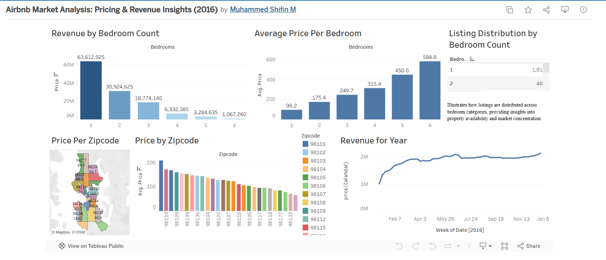

# Airbnb Market Analysis: Pricing & Revenue Insights (2016)

## 📌 Overview

This project presents an interactive Tableau dashboard analyzing Airbnb market trends using the 2016 Airbnb dataset sourced from Kaggle.

The dashboard focuses on pricing patterns, revenue generation, bedroom distribution, and geographic insights across zip codes.

---

## 🎯 Objectives

* Analyze Airbnb pricing trends by zip code
* Understand revenue distribution across bedroom categories
* Evaluate listing concentration by bedroom count
* Visualize geographic pricing patterns
* Track revenue trends over time

---

## 🛠️ Tools Used

* Tableau
* Data Visualization
* Exploratory Data Analysis (EDA)
* Dashboard Design

---

## 📊 Dashboard Features

* Revenue by Bedroom Count
* Average Price per Bedroom
* Listing Distribution by Bedroom Count
* Price by Zipcode
* Geographic Pricing Map
* Revenue Trend Analysis

---

## 🔗 Live Dashboard

👉 [View Tableau Dashboard Here](https://public.tableau.com/app/profile/muhammed.shifin.m/viz/AirbnbMarketAnalysisPricingRevenueInsights2016/AirbnbMarketAnalysisDashboard2016?publish=yes)

---

## 📸 Dashboard Preview

---

## 🚀 Key Insights

* One-bedroom listings generated the highest total revenue
* Higher bedroom counts showed significantly higher average pricing
* Revenue trends remained relatively stable throughout 2016
* Certain zip codes demonstrated higher pricing concentration compared to others

---

## 📁 Project Files

* `airbnb_2016_data.csv`
* Tableau dashboard screenshot
* README documentation

---

## 📬 Contact

* LinkedIn: www.linkedin.com/in/muhammedshifin

---
